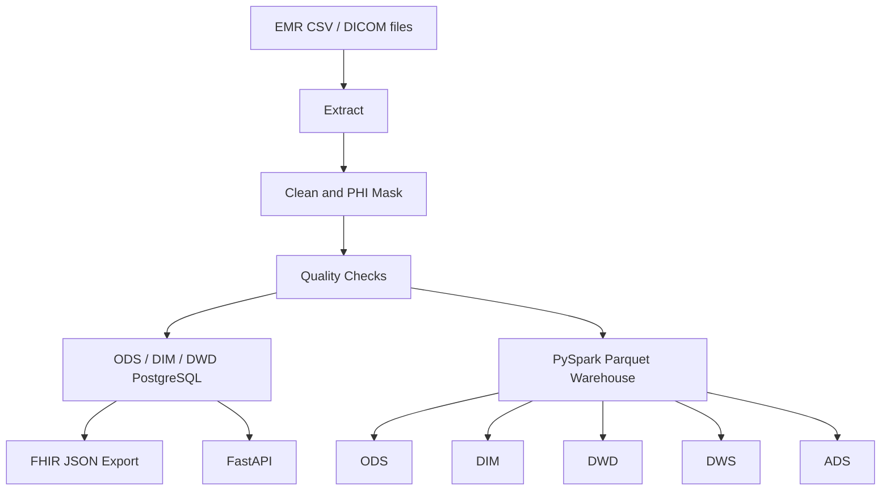

# Medical ETL and FHIR Data Platform

A medical data engineering platform for multi-source clinical data processing. The platform ingests EMR CSV data and DICOM metadata, performs cleaning, PHI masking, data quality checks, FHIR R4 conversion, layered warehouse modeling and API serving.

## Highlights

| Area | Implementation |
| --- | --- |
| Batch ETL | Python ETL baseline with Pandas |
| Distributed processing | PySpark job that builds ODS, DIM, DWD, DWS and ADS Parquet layers |
| Warehouse modeling | Layered ODS-DIM-DWD-DWS-ADS design with SQL scripts and documentation |
| Data quality | Required-field, uniqueness, allowed-value and date checks with CSV reports |
| Medical standardization | FHIR Patient and Observation JSON export |
| Orchestration | Airflow DAG with TaskGroup and Spark warehouse task |
| Service layer | FastAPI endpoints for patient profile, exam records, patient 360 and FHIR Patient |

## Architecture



## Project Structure

```text
api/                 FastAPI service
dags/                Airflow DAGs
data/                Sample source data
docs/                Warehouse and quality documentation
sql/                 Warehouse DDL scripts
src/
  data_access/       EMR and DICOM ingestion
  processing/        Cleaning and PHI masking
  quality/           Data quality rules and reports
  spark/             PySpark warehouse job
  fhir/              FHIR conversion
  database/          PostgreSQL access
tests/               Unit tests
```

## Quick Start

Install dependencies:

```bash
pip install -r requirements.txt
```

Run the Python ETL baseline:

```bash
python run_etl.py
```

Run the Spark warehouse job:

```bash
python -m src.spark.warehouse_job --emr-csv data/emr/patients.csv --warehouse-path output/warehouse --batch-date 2026-07-06
```

Start the API:

```bash
uvicorn api.main:app --reload --host 0.0.0.0 --port 8000
```

Open Swagger UI:

[http://127.0.0.1:8000/docs](http://127.0.0.1:8000/docs)

## API Endpoints

| Method | Path | Parameters | Description |
| --- | --- | --- | --- |
| GET | `/api/patient/{patient_id}` | `patient_id`: masked patient id | Query patient profile from `dim_patient` |
| GET | `/api/patient/{patient_id}/observations` | `patient_id`: masked patient id | Query exam records from `dwd_exam_record_detail` |
| GET | `/api/ads/patient-360/{patient_id}` | `patient_id`: masked patient id | Query patient 360 serving view from `ads_patient_360_view` |
| GET | `/api/fhir/patient/{patient_id}` | `patient_id`: masked patient id | Return a FHIR Patient resource |

## Warehouse Layers

See [docs/warehouse_model.md](docs/warehouse_model.md).

## Data Quality

See [docs/data_quality.md](docs/data_quality.md).

## Runtime Notes

Spark local execution is best run with Java 11 or Java 17. See [docs/runtime.md](docs/runtime.md).

## Engineering Scope

- Medical data ingestion, cleaning, PHI masking, FHIR conversion, warehouse modeling, orchestration and API serving.
- PySpark batch processing for ODS, DIM, DWD, DWS and ADS Parquet layers.
- Data quality checks for completeness, uniqueness, value domains and date validity.
- Patient and exam modeling for detail, summary and serving-layer query scenarios.
