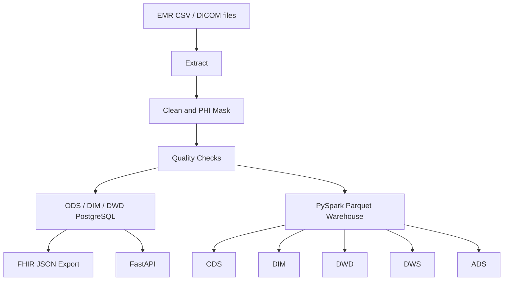

# Medical ETL and FHIR Data Platform

[Offline teaching: 15 chapters, updated 2026-09-25](docs/html/01-overview.html) — includes full Spark, Airflow retry and Parquet consumer walkthroughs.

> 2026-09-25: Stage M ten-thousand-patient full Spark → FHIR/PostgreSQL acceptance is complete. Independent r6 passes production dag.test, real scheduler, both consumer retries, 11 database content comparisons, 708,747 equivalent FHIR resources and 132 serial ASGI checks. Original logs and retained artifact hashes have been independently verified. See [current handoff](docs/HANDOFF_STAGE_M.md), [Stage M](docs/stage-m/README.md), and [project explanation](PROJECT_REVIEW_GUIDE.md).

A medical data engineering platform for multi-source clinical data processing. The platform ingests EMR CSV data and DICOM metadata, performs cleaning, PHI masking, data quality checks, FHIR R4B (4.3.0) conversion, layered warehouse modeling and API serving.

## Current checkpoint

Updated 2026-09-25; historical measurements below retain their original scope. Python streaming ETL processes 1,725,660 source rows into 11,476 patients, 677,836 encounters, 19,435 studies and 1,036,348 instances in 392.618 seconds, with a sampled process-tree RSS peak of 280.76 MiB. PostgreSQL loading and 132 serial ASGI API checks are verified in an isolated schema; an initial post-load OperationalError remains unexplained. FHIR R4B summary export produces 708,747 resources in 253.326 seconds with 74.07 MiB sampled RSS.

Full Spark CSV ETL matches the same ten-thousand-patient Python baseline in all 14 comparison groups, with 26 internal checks passing: 283.201 seconds including readback/comparison and about 2.52 GiB sampled process-tree RSS. This is WSL/JDK 21 Spark local[2], not a distributed-cluster benchmark or a 500 MiB result. Stage H Airflow already validates the old snapshot → FHIR → three-summary-table Spark workflow at ten-thousand-patient scale. The new full-ETL workflow separately passes thousand-patient DagBag, dag.test and real scheduler acceptance; the second task attempt reuses the first successful output.

Spark Parquet directories now feed the PostgreSQL/FHIR loaders through a shared batch reader. Thousand-patient acceptance passes 11 bidirectional database comparisons, 73,627 semantically identical FHIR resources, idempotent replay and 132 serial API checks. See [consumer evidence](docs/stage-k/README.md). The four-task full Spark DAG now also passes thousand-patient DagBag, dag.test and real scheduler acceptance, with both consumer tasks reusing successful results after injected failures. Independent ten-thousand-patient acceptance also passes in r6, including both consumer retries, 708,747 equivalent FHIR resources, 11 database content comparisons and 132 serial ASGI checks. The acceptance status reader recovered from eight SQLite lock conflicts using bounded retries. Spark uses an explicit 2 GiB JVM heap; no new RSS measurements were taken. See [Stage M](docs/stage-m/README.md). See [Stage L](docs/stage-l/README.md). Official file publication remains `stage-c-verified`; concurrent HTTP load, official FHIR Validator/server and CDC are not verified. [Streaming](docs/stage-e/STREAMING.md) · [Database/API](docs/stage-f/README.md) · [FHIR/Spark summaries](docs/stage-g/README.md) · [Old Airflow](docs/stage-h/README.md) · [Full Spark](docs/stage-i/README.md) · [Full Spark Airflow](docs/stage-j/README.md).

## Synthea snapshot workflow (stage C)

The current entry point reads the official Synthea CSV archive, preserves patient/encounter/study/series/instance grains, and publishes a versioned snapshot. Start with [the stage C runbook](docs/stage-c/README.md). Use the project `.venv` and `requirements-core.lock.txt` for this tested core workflow.

```powershell
.\.venv\Scripts\python.exe -m scripts.local_postgres start
.\.venv\Scripts\python.exe run_etl.py --publish-db
.\.venv\Scripts\python.exe -m uvicorn api.main:app --host 127.0.0.1 --port 8000
```

New endpoints use `/api/synthea/`. Database credentials are read from a local Git-ignored configuration; the original system database is not modified. Run `python run_etl.py --legacy-emr` only to invoke the original EMR demo and its legacy database configuration. The legacy architecture and endpoint descriptions below remain for reference. The current Synthea evidence is summarized above; concurrent HTTP load testing remains pending.

## Highlights

| Area | Implementation |
| --- | --- |
| Batch ETL | Python ETL baseline with Pandas |
| Distributed processing | PySpark job that builds ODS, DIM, DWD, DWS and ADS Parquet layers |
| Warehouse modeling | Layered ODS-DIM-DWD-DWS-ADS design with SQL scripts and documentation |
| Data quality | Required-field, uniqueness, allowed-value and date checks with CSV reports |
| Medical standardization | FHIR Patient and Observation JSON export |
| Orchestration | Airflow DAG with TaskGroup and Spark warehouse task |
| Service layer | FastAPI endpoints for patient profile, exam records, patient 360 and FHIR Patient |

## Architecture


```mermaid
flowchart TD
    A["EMR CSV / DICOM files"] --> B["Extract"]
    B --> C["Clean and PHI Mask"]
    C --> D["Quality Checks"]
    D --> E["ODS / DIM / DWD PostgreSQL"]
    D --> F["PySpark Parquet Warehouse"]
    F --> F1["ODS"]
    F --> F2["DIM"]
    F --> F3["DWD"]
    F --> F4["DWS"]
    F --> F5["ADS"]
    E --> G["FHIR JSON Export"]
    E --> H["FastAPI"]
```

## Project Structure

```text
api/                 FastAPI service
dags/                Airflow DAGs
data/                Sample source data
docs/                Warehouse and quality documentation
sql/                 Warehouse DDL scripts
src/
  data_access/       EMR and DICOM ingestion
  processing/        Cleaning and PHI masking
  quality/           Data quality rules and reports
  spark/             PySpark warehouse job
  fhir/              FHIR conversion
  database/          PostgreSQL access
tests/               Unit tests
```

## Quick Start

Install dependencies:

```bash
pip install -r requirements.txt
```

Run the legacy Python EMR baseline (uses legacy database settings):

```bash
python run_etl.py --legacy-emr
```

Run the Spark warehouse job:

```bash
python -m src.spark.warehouse_job --emr-csv data/emr/patients.csv --warehouse-path output/warehouse --batch-date 2026-07-06
```

Start the API:

```bash
uvicorn api.main:app --reload --host 0.0.0.0 --port 8000
```

Open Swagger UI:

[http://127.0.0.1:8000/docs](http://127.0.0.1:8000/docs)

## API Endpoints

| Method | Path | Parameters | Description |
| --- | --- | --- | --- |
| GET | `/api/patient/{patient_id}` | `patient_id`: masked patient id | Query patient profile from `dim_patient` |
| GET | `/api/patient/{patient_id}/observations` | `patient_id`: masked patient id | Query exam records from `dwd_exam_record_detail` |
| GET | `/api/ads/patient-360/{patient_id}` | `patient_id`: masked patient id | Query patient 360 serving view from `ads_patient_360_view` |
| GET | `/api/fhir/patient/{patient_id}` | `patient_id`: masked patient id | Return a FHIR Patient resource |

## Warehouse Layers

See [docs/warehouse_model.md](docs/warehouse_model.md).

## Data Quality

See [docs/data_quality.md](docs/data_quality.md).

## Runtime Notes

The full Synthea Spark workflow is verified with PySpark 4.0.1 and JDK 21 in WSL. See [current environment and run commands](docs/HANDOFF_SPARK_FULL_ETL.md); older runtime notes describe the legacy example.

## Engineering Scope

- Medical data ingestion, cleaning, PHI masking, FHIR conversion, warehouse modeling, orchestration and API serving.
- PySpark batch processing for ODS, DIM, DWD, DWS and ADS Parquet layers.
- Data quality checks for completeness, uniqueness, value domains and date validity.
- Patient and exam modeling for detail, summary and serving-layer query scenarios.
