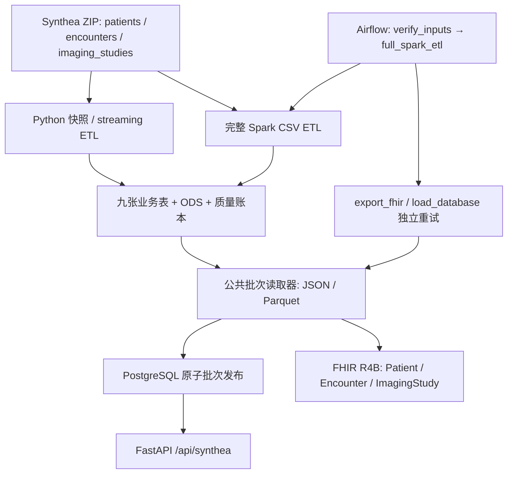

# Medical ETL and FHIR Data Platform

基于 **Synthea 合成医疗数据**的可复现数据工程项目：从 CSV 归档出发，完成质量治理、分层数仓、来源追溯、FHIR R4B 摘要导出、PostgreSQL 加载和 FastAPI 查询。Python 提供参考实现与流式处理，Spark 实现相同业务口径，Airflow 负责完整链路及失败重试。

[文档导航](docs/README.md) · [项目复习指南](PROJECT_REVIEW_GUIDE.md) · [离线教学（15 章）](docs/html/01-overview.html) · [最新验收与交接](docs/HANDOFF_STAGE_M.md)

## 当前完成度

截至 2026-09-25，Stage M r6 已完成万人数据完整链路验收。以下为已归档实测，并非本次重新运行结果。

| 范围 | 已验证结果 | 证据 |
| --- | --- | --- |
| Python 流式 ETL | 1,725,660 源行；392.618 秒；采样进程树 RSS 280.76 MiB | [Stage E](docs/stage-e/STREAMING.md) |
| 完整 Spark ETL | 与 Python 基准 14 组双向多重集对账一致；26 项内部检查通过 | [Stage I](docs/stage-i/README.md) |
| 四任务 Airflow DAG | DagBag、生产 dag.test、真实 scheduler；两个消费者失败后重试复用成功产物 | [Stage M](docs/stage-m/README.md) |
| Spark 下游消费 | 708,747 个 FHIR 资源内容等价；数据库 11 组内容核验通过；132 次串行 ASGI 检查通过 | [r6 报告](docs/stage-m/full-consumers-p10000-r6/acceptance.json) |

“万人”是数据集规模标签，实际包含 11,476 位患者、677,836 次就诊、19,435 项检查和 1,036,348 个影像实例。Spark 实测为 WSL/JDK 21 的 `local[2]`；Stage I 采样 RSS 约 2.52 GiB，Stage M 未新增 RSS 测量。500 MiB 结论仅适用于已测 Python 客户端范围。

官方 FHIR Validator/完整 FHIR Server、HTTP 并发、多机集群和增量 CDC 尚未验收。正式发布指针在 Stage M 验收前后仍为 `stage-c-verified`。

## 数据流与架构


```mermaid
flowchart TD
    A["Synthea ZIP: patients / encounters / imaging_studies"] --> B["Python 快照 / streaming ETL"]
    A --> C["完整 Spark CSV ETL"]
    B --> D["九张业务表 + ODS + 质量账本"]
    C --> D
    D --> E["公共批次读取器: JSON / Parquet"]
    E --> F["PostgreSQL 原子批次发布"]
    E --> G["FHIR R4B: Patient / Encounter / ImagingStudy"]
    F --> H["FastAPI /api/synthea"]
    I["Airflow: verify_inputs → full_spark_etl"] --> C
    I --> J["export_fhir / load_database 独立重试"]
    J --> E
```

患者、就诊、检查、序列、实例分别建模；检查次数不能用实例数代替。ODS 保留原始字段、文件 SHA-256 和逻辑记录序号；同键冲突与父子关系异常进入处置账本。详见[数仓模型](docs/warehouse_model.md)和[质量规则](docs/data_quality.md)。

## 快速开始：仅运行文件 ETL

在项目根目录使用 PowerShell。已有 `.venv` 时直接复用；首次安装需要本机 Python。核心环境不需要 Spark、Java、Airflow 或数据库，依赖使用已验证的锁定文件。

```powershell
python -m venv .venv
.\.venv\Scripts\python.exe -m pip install -r requirements-core.lock.txt

# 先把已有的 Synthea CSV ZIP 放到该位置；数据文件不随 Git 分发
Test-Path data/external/synthea_csv.zip

# 使用独立输出目录；省略 run-id 自动生成新批次
.\.venv\Scripts\python.exe run_etl.py --archive data/external/synthea_csv.zip --output-root output/quickstart
```

ZIP 必须恰好包含各一份 `patients.csv`、`encounters.csv`、`imaging_studies.csv`，允许在归档子目录内。必需字段见 [REQUIRED 定义](src/synthea_pipeline.py)。脚本不会自动下载数据；应复用已有归档，并保留来源和哈希。没有数据时可先运行下方合成 fixture 测试。

成功后查看 `output/quickstart/runs/<run_id>/manifest.json` 和该目录中的数据产物；`output/quickstart/current.json` 指向成功批次。同名运行目录不可覆盖。此命令只更新独立文件输出，不加载数据库。大规模流式入口及出生日期时区参数见[运行说明](docs/runtime.md)。

## 可选：PostgreSQL 与 API

先安装 PostgreSQL；本机管理脚本默认寻找 `C:\Program Files\PostgreSQL\18\bin`，其他安装位置通过 `--pg-bin` 指定。

```powershell
# 首次创建项目独立实例；已有配置时使用 start
.\.venv\Scripts\python.exe -m scripts.local_postgres init
.\.venv\Scripts\python.exe -m scripts.local_postgres status

# 将上一步成功目录中的 <run_id> 替换为实际值
.\.venv\Scripts\python.exe -m src.database.synthea_store --run-dir output/quickstart/runs/<run_id>
.\.venv\Scripts\python.exe -m uvicorn api.main:app --host 127.0.0.1 --port 8000
```

**加载命令会发布到所配置数据库的 `synthea_v1` schema，并切换其当前批次。** 在已有验收环境中，如只阅读结果，直接启动已有实例和 API，不执行加载。文件指针与数据库指针独立，数据库加载不是跨系统事务。

连接默认读取被 Git 忽略的 `output/local-postgres/connection.json`，也支持 `SYNTHEA_DATABASE_URL` 或 `SYNTHEA_DB_CONFIG`。本地实例默认仅监听 `127.0.0.1:55432`，不修改原系统服务。完整说明见[运行环境](docs/runtime.md)。

打开 [Swagger UI](http://127.0.0.1:8000/docs)。当前 Synthea 接口如下：

| GET 路径 | 用途 |
| --- | --- |
| `/api/synthea/status` | 当前数据库发布批次及行数 |
| `/api/synthea/patients/{patient_key}` | 患者概览，包含零检查患者 |
| `/api/synthea/patients/{patient_key}/studies` | 患者检查列表 |
| `/api/synthea/studies/{study_key}/lineage` | 实例源文件哈希和逻辑记录序号 |

`patient_key` / `study_key` 是快照中的稳定替代键，不是源 Id。FHIR 是独立导出流程；旧 `/api/fhir/patient/{patient_id}` 接口不代表当前 Synthea FHIR 服务。API 当前用于本机开发，验收为串行 ASGI 调用。

## 项目结构

```text
api/                         FastAPI；synthea.py 为当前快照查询
src/
  synthea_pipeline.py        小样本快照、字段契约与质量口径
  streaming_pipeline.py      大规模 Python 流式 ETL
  snapshot_reader.py         JSON / Parquet 公共批次读取器
  spark/                     完整 Synthea Spark ETL、对账及旧 EMR 作业
  spark_full_workflow.py     Spark 尝试隔离、产物校验与重试复用
  consumer_workflow.py       FHIR / 数据库消费者恢复与内容核验
  airflow_tasks.py           独立 worker 调用与路径适配
  database/                  PostgreSQL 加载与旧 EMR 数据库代码
  fhir/                      Synthea 摘要导出与旧转换器
  data_access/ processing/   旧 EMR / DICOM 示例
  quality/                   旧示例通用质量规则
scripts/                     本地数据库、基准测试、验收与证据归档
  airflow/                   Linux 环境和 Airflow 验收脚本
dags/                        当前四任务 DAG 与历史 DAG
sql/                         SQL 建模脚本；当前表契约以代码为准
tests/                       单元、数据库、Spark 和工作流测试
data/                        小型 EMR 示例；外部/生成数据由 Git 忽略
output/                      本地批次、数据库与运行产物，由 Git 忽略
docs/                        文档导航、阶段证据、交接和离线教材
run_etl.py                   默认 Synthea 小样本入口；--legacy-emr 切换旧例
```

## 开发验证

不依赖外部归档的核心测试（测试自行构造合成输入；数据库用例默认跳过）：

```powershell
.\.venv\Scripts\python.exe -m pytest -q tests/test_synthea_pipeline.py tests/test_synthea_reliability.py
```

数据库测试需显式设置 `RUN_DATABASE_TESTS=1` 且数据库可用。Spark/Airflow 测试使用各自运行环境，不能将跳过的用例视为通过。环境划分、常见问题及旧 EMR 运行方式见[运行说明](docs/runtime.md)。

## 阅读与维护

从[文档导航](docs/README.md)按用途进入。阶段报告保留当时规模、失败现场和测试范围，最新状态以 [Stage M 交接](docs/HANDOFF_STAGE_M.md)为准。HTML 教材应编辑正文片段后构建，方法见[教材维护说明](docs/html/README.md)。
