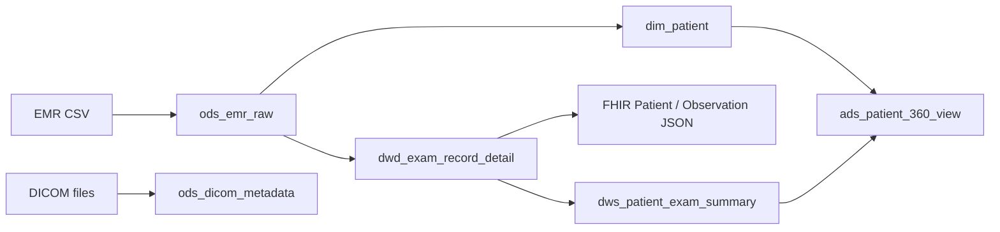

# Warehouse Model

This project uses a layered warehouse design for a medical ETL and FHIR platform.

## ODS

The ODS layer keeps source-shaped data with minimal standardization.

| Table | Grain | Description |
| --- | --- | --- |
| `ods_emr_raw` | one EMR row | Patient profile and exam event from CSV |
| `ods_dicom_metadata` | one DICOM file | Imaging metadata extracted from DICOM files |

## DIM

The DIM layer stores reusable business dimensions.

| Table | Grain | Description |
| --- | --- | --- |
| `dim_patient` | one patient | Masked patient profile, gender and birth year |
| `dim_exam_type` | one exam type | Exam type standardization |
| `dim_date` | one calendar date | Date analysis dimension |

## DWD

The DWD layer stores clean business detail records.

| Table | Grain | Description |
| --- | --- | --- |
| `dwd_exam_record_detail` | one patient exam | Standardized exam detail after PHI masking |
| `dwd_fhir_observation_detail` | one FHIR Observation | FHIR-friendly observation detail |

## DWS

The DWS layer stores reusable summaries.

| Table | Grain | Description |
| --- | --- | --- |
| `dws_patient_exam_summary` | one patient | Exam count, latest exam date and exam type count |
| `dws_exam_type_daily_stats` | one date and exam type | Daily exam statistics |

## ADS

The ADS layer serves API and dashboard scenarios.

| Table | Grain | Description |
| --- | --- | --- |
| `ads_patient_360_view` | one patient | Patient profile plus exam summary |

## Lineage

